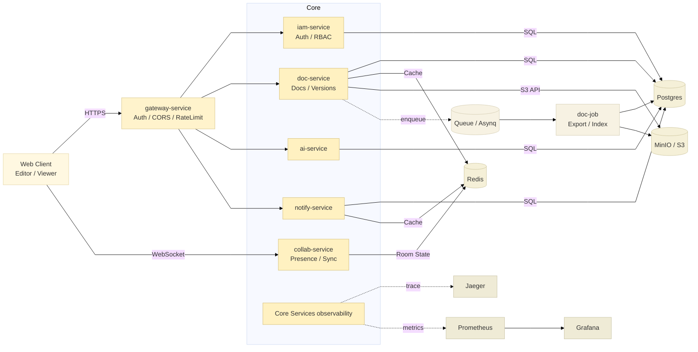

# Atlas | 像扛着整个文档世界
The Next-generation Open Source Collaborative Document System

Atlas 是面向中小型团队/社区的一款开源在线文档协作平台，提供**多人实时协作**、**离线编辑自动合并**、**版本回溯**、**权限管理**与**AI 辅助写作**等能力。

系统后端基于 GO 微服务框架 [go-kratos](https://go-kratos.dev/)。

## Atlas 核心技术栈

秉持高效、稳定、可扩展的技术选型理念，系统核心技术栈如下：

- 后端： [Golang](https://go.dev/) + [go-kratos](https://go-kratos.dev/) + [wire](https://github.com/google/wire) + [ent](https://entgo.io/docs/getting-started/)

## 核心功能列表

| 功能 | 说明 |
|------|------|
| 用户与账号 | 注册/登录/退出；个人信息维护（昵称、头像）；账号安全 |
| 文档 | 新建、编辑、重命名、移动、删除；自动保存；最近访问与收藏。 |
| 文件夹 | 多级目录管理：新建/重命名/移动/删除；拖拽排序、批量操作。 |
| 多人实时协作 | 多人同时编辑同一篇文档；实时同步内容；在线成员可见；断线自动重连。 |
| 协作状态 | 展示他人光标/选区、用户颜色、正在输入提示，让协作更直观。 |
| 离线编辑与自动合并 | 网络断开也能继续编辑；恢复网络后自动同步与合并；合并失败提示与兜底方案。 |
| 版本与回溯 | 自动生成历史版本；查看版本列表；一键回滚；版本差异对比。 |
| 评论与批注 | 文档评论；按段落/选区批注、回复、已解决状态、@提及。 |
| 权限管理 | 对文档/文件夹设置成员权限；预置 Owner/Editor/Viewer；分享链接与有效期。 |
| AI 辅助写作 | 总结、生成大纲、续写、改写、润色；支持对选中内容或整篇文档生效。 |
| 通知 | 评论/@提及/权限变更等站内通知；邮件/Webhook。 |
| 文件与附件 | 图片/附件上传、预览、下载与引用；对接对象存储与访问控制。 |
| 稳定性与运维 | 健康检查、日志与监控能力，便于部署与运维。 |

## 仓库结构（概览）

- `backend/`：后端（go-kratos 微服务、proto/buf、部署与脚本）
- `frontend/`：前端（Vue 工程，待初始化/补齐）
- `docs/`：项目文档（架构、API 规范、协作协议、权限模型等）

## 快速开始

1. 后端：进入 `backend/` 按 `backend/README.md` 启动依赖与服务（Postgres/Redis/MinIO 等）。
2. 前端：进入 `frontend/`安装依赖并启动开发服务器。

## 文档入口

- 架构说明：`docs/architecture.md`
- 接口规范：`docs/api-guideline.md`
- 权限模型：`docs/rbac-model.md`
- 协作协议：`docs/collab-protocol.md`

项目架构图
