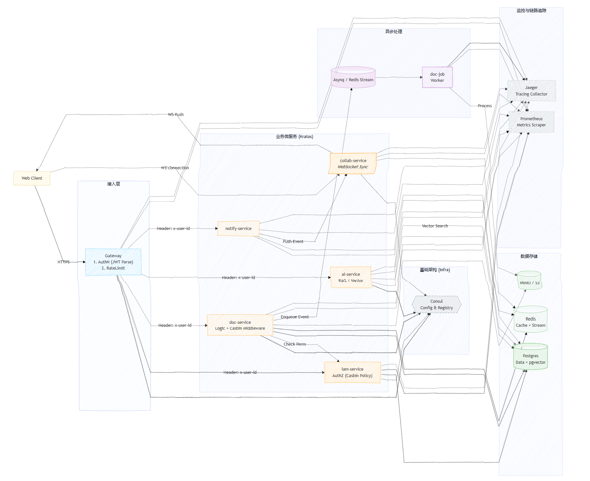

# Atlas | 像扛着整个文档世界
The Next-generation Open Source Collaborative Document System

Atlas 是面向中小型团队/社区的一款开源在线文档协作平台，提供**多人实时协作**、**离线编辑自动合并**、**版本回溯**、**权限管理**与**AI 辅助写作**等能力。

系统后端基于 GO 微服务示例 [krathub](https://github.com/HoronLee/krathub)。

## Atlas 核心技术栈

秉持高效、稳定、可扩展的技术选型理念，系统核心技术栈如下：

- 后端： [Go](https://go.dev/) + [Kratos v2](https://go-kratos.dev/) + [Wire](https://github.com/google/wire)
- API/代码生成： [Protobuf](https://protobuf.dev/) + [Buf](https://buf.build/)（含 OpenAPI 生成）
- 数据层： [PostgreSQL](https://www.postgresql.org/) + [GORM](https://gorm.io/) + [GORM Gen](https://gorm.io/gen/)
- 缓存： [Redis](https://redis.io/)
- 前端： [Vue 3](https://vuejs.org/) + [Vite](https://vite.dev/) + [TypeScript](https://www.typescriptlang.org/)
- 前端工具链： [Bun](https://bun.sh/)
- 工程化： Make（统一构建/生成/运行脚本）

## 核心功能列表

| 功能 | 说明 |
|------|------|
| 用户与账号 | 注册/登录/退出；个人信息维护（昵称、头像）；账号安全 |
| 文档 | 新建、编辑、重命名、移动、删除；自动保存；最近访问与收藏。 |
| 文件夹 | 多级目录管理：新建/重命名/移动/删除；拖拽排序、批量操作。 |
| 多人实时协作 | 多人同时编辑同一篇文档；实时同步内容；在线成员可见；断线自动重连。 |
| 协作状态 | 展示他人光标/选区、用户颜色、正在输入提示，让协作更直观。 |
| 离线编辑与自动合并 | 网络断开也能继续编辑；恢复网络后自动同步与合并；合并失败提示与兜底方案。 |
| 版本与回溯 | 自动生成历史版本；查看版本列表；一键回滚；版本差异对比。 |
| 评论与批注 | 文档评论；按段落/选区批注、回复、已解决状态、@提及。 |
| 权限管理 | 对文档/文件夹设置成员权限；预置 Owner/Editor/Viewer；分享链接与有效期。 |
| AI 辅助写作 | 总结、生成大纲、续写、改写、润色；支持对选中内容或整篇文档生效。 |
| 通知 | 评论/@提及/权限变更等站内通知；邮件/Webhook。 |
| 文件与附件 | 图片/附件上传、预览、下载与引用；对接对象存储与访问控制。 |
| 稳定性与运维 | 健康检查、日志与监控能力，便于部署与运维。 |

# 快速开始
### 前置要求

- Go 1.21 或更高版本
- Buf CLI (用于 Protobuf 管理)
- Wire (用于依赖注入)
- Make 工具

### 克隆项目

```shell
# 克隆项目
git clone https://github.com/ToAtlas/AtlasBackend.git
cd krathub
```

### 安装开发工具

```
# 通过Make初始化开发环境
make init
```

### 配置项目

```shell
# 复制配置示例文件
cp api/protos/conf/v1/config-example.yaml app/krathub/service/configs/config.yaml

# 根据需要修改配置
vim app/krathub/service/configs/config.yaml
```

### 生成代码并启动

```shell
# 生成所有代码（protobuf、wire、openapi）
make gen

# 构建并运行 krathub 服务
cd app/krathub/service
make run
```

服务启动后，HTTP 服务将监听在 `0.0.0.0:8000`，gRPC 服务将监听在 `0.0.0.0:8001` (以默认配置为例)。

## 📁 项目结构

```
.
├── api/                                # Protobuf API 定义与代码生成相关配置
│   ├── buf.gen.yaml                    # Buf 代码生成配置（Go）
│   ├── buf.work.yaml                   # Buf workspace 配置
│   ├── buf.{service}.openapi.gen.yaml  # 各服务 OpenAPI 生成配置
│   ├── gen/                            # 生成的代码
│   │   └── go/                         # 生成的 Go protobuf 代码
│   └── protos/                         # Proto 源文件
│       ├── buf.yaml                    # Proto 依赖配置
│       ├── conf/v1/                    # 配置定义（proto）与配置示例
│       ├── krathub/service/v1/         # Krathub HTTP 接口（i_*.proto）
│       ├── auth/service/v1/            # Auth gRPC 服务
│       ├── user/service/v1/            # User gRPC 服务
│       ├── test/service/v1/            # Test gRPC 服务
│       └── sayhello/service/v1/        # SayHello 独立微服务
│
├── app/                                # 微服务应用目录
│   ├── krathub/service/                # Krathub 主服务
│   │   ├── cmd/server/                 # 服务启动入口
│   │   ├── internal/                   # 内部实现（不对外暴露）
│   │   │   ├── biz/                    # 业务逻辑层
│   │   │   ├── data/                   # 数据访问层
│   │   │   ├── server/                 # gRPC/HTTP 服务器配置
│   │   │   └── service/                # Service 层实现
│   │   ├── configs/                    # 服务配置文件（运行时 config.yaml）
│   │   ├── bin/                        # 编译输出目录
│   │   ├── openapi.yaml                # 生成的 OpenAPI 文档
│   │   └── Makefile                    # 服务级 Makefile（include app.mk）
│   │
│   └── sayhello/service/               # SayHello 独立微服务（示例）
│       ├── openapi.yaml                # 生成的 OpenAPI 文档
│       └── Makefile                    # 服务级 Makefile
│
├── manifest/                           # 部署相关文件
│   ├── SQL/                            # 数据库脚本
│   ├── docker/                         # Docker 配置
│   └── kubernetes/                     # K8s 配置
│
├── pkg/                                # 项目内部共享的通用库
├── examples/                           # 示例项目
│
├── .env.example                        # 环境变量示例（需复制为 .env）
├── .env                                # 本地环境变量（建议加入 .gitignore）
├── app.mk                              # 通用服务 Makefile（所有服务共享）
└── Makefile                            # 根目录 Makefile（管理所有服务
```


### Proto 文件组织规范

项目采用以下 Proto 文件组织规范：

1. **HTTP 接口文件** (`i_*.proto`)
	- 位置：`api/protos/krathub/service/v1/i_*.proto`
	- 包名：统一使用 `krathub.service.v1`
	- 用途：包含 HTTP 注解的接口定义，用于生成 OpenAPI 文档
	- 示例：`i_auth.proto`, `i_user.proto`, `i_test.proto`

2. **gRPC 服务文件**
	- 位置：`api/protos/{service}/service/v1/{service}.proto`
	- 包名：独立包名 `{service}.service.v1`
	- 用途：纯 gRPC 接口定义，不包含 HTTP 注解
	- 示例：`auth/service/v1/auth.proto`, `user/service/v1/user.proto`

3. **独立微服务**
	- 位置：`api/protos/{service}/service/v1/{service}.proto`
	- 包名：独立包名 `{service}.service.v1`
	- 用途：完全独立的微服务，可包含 HTTP 注解
	- 示例：`sayhello/service/v1/sayhello.proto`

## 📝 开发流程

推荐的开发顺序如下，以确保依赖关系正确：

### 1. 定义 API (`api/protos/`)

在 `.proto` 文件中定义服务接口：

```protobuf
// HTTP 接口：api/protos/krathub/service/v1/i_example.proto
syntax = "proto3";
package krathub.service.v1;

import "google/api/annotations.proto";

service Example {
  rpc GetExample(GetExampleRequest) returns (GetExampleResponse) {
    option (google.api.http) = {
      get: "/api/v1/example/{id}"
    };
  }
}
```

### 2. 生成代码

```shell
# 在根目录生成所有 protobuf 代码
make api

# 为所有服务生成 OpenAPI 文档
make openapi

# 或者一次性生成所有代码
make gen
```

### 3. 实现业务逻辑

按照 Kratos 的分层架构实现：

1. **业务逻辑层** (`internal/biz/`): 定义业务接口和实现
2. **数据访问层** (`internal/data/`): 实现数据持久化
3. **服务层** (`internal/service/`): 实现 API 接口

### 4. 依赖注入

在 `cmd/server/wire.go` 中注册新组件：

```go
//go:build wireinject
// +build wireinject

func wireApp(...) (*kratos.App, func(), error) {
    panic(wire.Build(
        server.ProviderSet,
        data.ProviderSet,
        biz.ProviderSet,
        service.ProviderSet,
        newApp,
    ))
}
```

生成依赖注入代码：

```shell
# 在服务目录下
cd app/krathub/service
make wire
```

### 5. 运行和测试

```shell
# 在服务目录下运行
cd app/krathub/service
make run

# 或者在根目录构建所有服务
make build
```

## 🛠️ 常用命令

### 根目录命令（管理所有服务）

#### 初始化和设置

- `make init` - 安装所有开发工具（buf, wire, protoc 插件等）
- `make plugin` - 安装 protoc 插件
- `make cli` - 安装 CLI 工具（kratos, buf, wire 等）

#### 代码生成

- `make api` - 生成所有 protobuf Go 代码
- `make openapi` - 为所有服务生成 OpenAPI 文档
- `make wire` - 为所有服务生成 wire 依赖注入代码
- `make gen` - 生成所有代码（api + openapi + wire）

#### 构建和运行

- `make build` - 构建所有服务（包含代码生成）
- `make build_only` - 仅构建所有服务（不生成代码）
- `make all` - 生成并构建所有服务

#### 代码质量

- `make test` - 运行所有测试
- `make lint` - 运行代码检查
- `make vet` - 运行静态分析

#### 其他

- `make clean` - 清理所有构建产物
- `make env` - 显示环境变量
- `make help` - 显示帮助信息

### 服务级命令（在服务目录下执行）

进入服务目录：`cd app/krathub/service`

#### 开发命令

- `make run` - 运行服务（包含代码生成）
- `make build` - 构建服务（包含代码生成）
- `make build_only` - 仅构建服务
- `make app` - 生成并构建服务

#### 代码生成

- `make api` - 生成 protobuf 代码
- `make openapi` - 生成 OpenAPI 文档
- `make wire` - 生成 wire 代码
- `make ent` - 生成 ent 代码（如果使用 ent）
- `make genDao` - 生成 GORM GEN 的 PO 和 DAO 代码（如果使用 gorm-gen）
- `make gen` - 生成所有代码

#### 其他

- `make clean` - 清理构建产物
- `make docker-build` - 构建 Docker 镜像
- `make env` - 显示环境变量

### Buf 相关命令

- `make lint-proto` - 检查 proto 文件规范
- `make buf-update` - 更新 buf 依赖

### 添加新服务

1. 创建服务目录结构：

```shell
mkdir -p app/newservice/service
```

2. 创建服务 Makefile：

```shell
echo "include ../../../app.mk" > app/newservice/service/Makefile
```

3. 创建 OpenAPI 生成配置：

```shell
# 复制并修改现有配置
cp api/buf.krathub.openapi.gen.yaml api/buf.newservice.openapi.gen.yaml
# 修改配置中的服务名称和路径
```

4. 定义 proto 文件并生成代码：

```shell
# 创建 proto 文件
mkdir -p api/protos/newservice/service/v1
# 编写 proto 文件...

# 生成代码
make api
make openapi
```

5. 实现服务代码（参考 krathub 服务结构）

根目录的 Makefile 会自动发现并管理新服务！



